# Key Objects

[_Documentation generated by Documatic_](https://www.documatic.com)

<!---Documatic-section-lambda.stats_test.test_should_handle_pageloads_with_one_sponsor-start--->
## lambda.stats_test.test_should_handle_pageloads_with_one_sponsor

<!---Documatic-section-test_should_handle_pageloads_with_one_sponsor-start--->
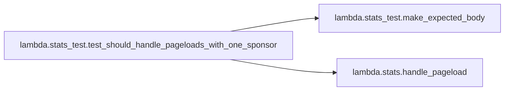

### Object Calls

* lambda.stats_test.make_expected_body
* lambda.stats.handle_pageload

<!---Documatic-block-lambda.stats_test.test_should_handle_pageloads_with_one_sponsor-start--->
<details>
	<summary><code>lambda.stats_test.test_should_handle_pageloads_with_one_sponsor</code> code snippet</summary>

```python
def test_should_handle_pageloads_with_one_sponsor(sqs_client):
    metrics = mock.Mock(spec_set=MetricsLogger)
    queue_url = 'some-queue-url'
    with Stubber(sqs_client) as stubber:
        stubber.add_response('send_message', {}, dict(QueueUrl=queue_url, MessageBody=ANY))
        stubber.add_response('send_message', {}, dict(QueueUrl=queue_url, MessageBody=make_expected_body('SponsorView', 'bob')))
        handle_pageload(dict(queryStringParameters=dict(icons='bob')), metrics, SOME_DATE, queue_url, sqs_client)
    metrics.set_property.assert_called_once_with('sponsors', ['bob'])
```
</details>
<!---Documatic-block-lambda.stats_test.test_should_handle_pageloads_with_one_sponsor-end--->
<!---Documatic-section-test_should_handle_pageloads_with_one_sponsor-end--->

# #
<!---Documatic-section-lambda.stats_test.test_should_handle_pageloads_with_one_sponsor-end--->

<!---Documatic-section-lambda.cloudwatch_to_discord.parse_sns_message-start--->
## lambda.cloudwatch_to_discord.parse_sns_message

<!---Documatic-section-parse_sns_message-start--->
<!---Documatic-block-lambda.cloudwatch_to_discord.parse_sns_message-start--->
<details>
	<summary><code>lambda.cloudwatch_to_discord.parse_sns_message</code> code snippet</summary>

```python
def parse_sns_message(sns_message):
    logging.info('sns message: %s', json.dumps(sns_message))
    description = ''
    title = 'CloudWatch Alert!'
    is_alarm = sns_message.get('Trigger', None)
    if is_alarm:
        parsed_message = [dict(name='Description', value=sns_message['AlarmDescription'], inline=False), dict(name='Event', value=sns_message['NewStateReason'], inline=False)]
        alarm_name = sns_message['AlarmName']
        url = f'{BASE_CW_URL}?region={REGION}#alarmsV2:alarm/{alarm_name}?'
        description = f'A [cloudwatch alarm]({url}) has posted to the SNS notification channel'
        title = f'CloudWatch Alert - {alarm_name}!'
    else:
        logging.error('Unparsed message: %s', sns_message)
        parsed_message = [dict(name='Something non-parseable happened...check the logs', value=json.dumps(sns_message)[:100] + '...')]
    discord_data = dict(username='AWS', avatar_url='https://a0.awsstatic.com/libra-css/images/logos/aws_logo_smile_1200x630.png', embeds=[dict(color=15610675, title=title, description=description, fields=parsed_message)])
    return discord_data
```
</details>
<!---Documatic-block-lambda.cloudwatch_to_discord.parse_sns_message-end--->
<!---Documatic-section-parse_sns_message-end--->

# #
<!---Documatic-section-lambda.cloudwatch_to_discord.parse_sns_message-end--->

<!---Documatic-section-lambda.stats_test.test_should_find_stats_on_a_compiler-start--->
## lambda.stats_test.test_should_find_stats_on_a_compiler

<!---Documatic-section-test_should_find_stats_on_a_compiler-start--->
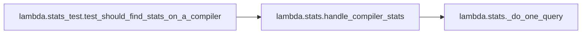

### Object Calls

* lambda.stats.handle_compiler_stats

<!---Documatic-block-lambda.stats_test.test_should_find_stats_on_a_compiler-start--->
<details>
	<summary><code>lambda.stats_test.test_should_find_stats_on_a_compiler</code> code snippet</summary>

```python
@pytest.mark.skip('run manually with creds')
def test_should_find_stats_on_a_compiler():
    res = handle_compiler_stats('gcc', 'compiler-builds', boto3.client('dynamodb'))
    print(res)
```
</details>
<!---Documatic-block-lambda.stats_test.test_should_find_stats_on_a_compiler-end--->
<!---Documatic-section-test_should_find_stats_on_a_compiler-end--->

# #
<!---Documatic-section-lambda.stats_test.test_should_find_stats_on_a_compiler-end--->

<!---Documatic-section-lambda.stats_test.test_should_mention_most_recent_compiler_build-start--->
## lambda.stats_test.test_should_mention_most_recent_compiler_build

<!---Documatic-section-test_should_mention_most_recent_compiler_build-start--->
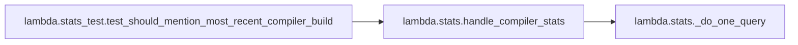

### Object Calls

* lambda.stats.handle_compiler_stats

<!---Documatic-block-lambda.stats_test.test_should_mention_most_recent_compiler_build-start--->
<details>
	<summary><code>lambda.stats_test.test_should_mention_most_recent_compiler_build</code> code snippet</summary>

```python
def test_should_mention_most_recent_compiler_build(dynamodb_client):

    def make_fake_item(run_id: str) -> Dict:
        return dict(path=dict(S='path'), github_run_id=dict(S=run_id), timestamp=dict(S='some time'), duration=dict(N='123'))
    with Stubber(dynamodb_client) as stubber:
        stubber.add_response('query', dict(Count=3, Items=[make_fake_item('first'), make_fake_item('second'), make_fake_item('third')]))
        stubber.add_response('query', dict(Count=2, Items=[make_fake_item('first_b'), make_fake_item('second_b')]))
        result = handle_compiler_stats('some-compiler', 'compiler-table', dynamodb_client)
    assert result['statusCode'] == 200
    assert json.loads(result['body']) == dict(last_success=dict(duration=123, github_run_id='first', path='path', timestamp='some time'), last_build=dict(duration=123, github_run_id='first_b', path='path', timestamp='some time'))
```
</details>
<!---Documatic-block-lambda.stats_test.test_should_mention_most_recent_compiler_build-end--->
<!---Documatic-section-test_should_mention_most_recent_compiler_build-end--->

# #
<!---Documatic-section-lambda.stats_test.test_should_mention_most_recent_compiler_build-end--->

<!---Documatic-section-lambda.stats.handle_sqs-start--->
## lambda.stats.handle_sqs

<!---Documatic-section-handle_sqs-start--->
<!---Documatic-block-lambda.stats.handle_sqs-start--->
<details>
	<summary><code>lambda.stats.handle_sqs</code> code snippet</summary>

```python
def handle_sqs(event: Dict, context, s3_client: Optional[botocore.client.BaseClient]=None, now: Optional[datetime.datetime]=None):
    s3_client = s3_client or boto3.client('s3')
    now = now or datetime.datetime.utcnow()
    logger.info('Handling %d messages', len(event[RECORD_KEY]))
    key = f"stats/{context.function_name}-{now.strftime('%Y-%m-%d-%H:%M:%S.%f')}.log"
    body = '\n'.join((r['body'] for r in event[RECORD_KEY]))
    bucket_name = os.environ['S3_BUCKET_NAME']
    logger.info('writing to %s with key %s', bucket_name, key)
    s3_client.put_object(Bucket=bucket_name, Body=body, Key=key)
```
</details>
<!---Documatic-block-lambda.stats.handle_sqs-end--->
<!---Documatic-section-handle_sqs-end--->

# #
<!---Documatic-section-lambda.stats.handle_sqs-end--->

<!---Documatic-section-lambda.stats_test.test_should_handle_pageloads_with_empty_sponsors-start--->
## lambda.stats_test.test_should_handle_pageloads_with_empty_sponsors

<!---Documatic-section-test_should_handle_pageloads_with_empty_sponsors-start--->
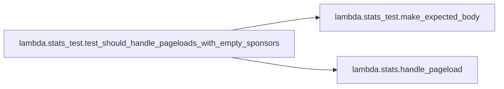

### Object Calls

* lambda.stats_test.make_expected_body
* lambda.stats.handle_pageload

<!---Documatic-block-lambda.stats_test.test_should_handle_pageloads_with_empty_sponsors-start--->
<details>
	<summary><code>lambda.stats_test.test_should_handle_pageloads_with_empty_sponsors</code> code snippet</summary>

```python
def test_should_handle_pageloads_with_empty_sponsors(sqs_client):
    metrics = mock.Mock(spec_set=MetricsLogger)
    queue_url = 'some-queue-url'
    with Stubber(sqs_client) as stubber:
        stubber.add_response('send_message', {}, dict(QueueUrl=queue_url, MessageBody=make_expected_body('PageLoad', '')))
        handle_pageload(dict(queryStringParameters=dict(icons='')), metrics, SOME_DATE, queue_url, sqs_client)
    metrics.set_property.assert_called_once_with('sponsors', [])
```
</details>
<!---Documatic-block-lambda.stats_test.test_should_handle_pageloads_with_empty_sponsors-end--->
<!---Documatic-section-test_should_handle_pageloads_with_empty_sponsors-end--->

# #
<!---Documatic-section-lambda.stats_test.test_should_handle_pageloads_with_empty_sponsors-end--->

<!---Documatic-section-lambda.cloudwatch_to_discord_test.test_can_parse_anomaly_event-start--->
## lambda.cloudwatch_to_discord_test.test_can_parse_anomaly_event

<!---Documatic-section-test_can_parse_anomaly_event-start--->
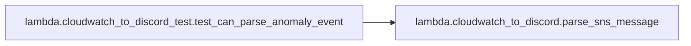

### Object Calls

* lambda.cloudwatch_to_discord.parse_sns_message

<!---Documatic-block-lambda.cloudwatch_to_discord_test.test_can_parse_anomaly_event-start--->
<details>
	<summary><code>lambda.cloudwatch_to_discord_test.test_can_parse_anomaly_event</code> code snippet</summary>

```python
def test_can_parse_anomaly_event():
    result = parse_sns_message(EXAMPLE_ANOMALY_EVENT)
    assert result['embeds'][0]['title'] == 'CloudWatch Alert - TrafficAnomaly!'
    import json
    print(json.dumps(result))
```
</details>
<!---Documatic-block-lambda.cloudwatch_to_discord_test.test_can_parse_anomaly_event-end--->
<!---Documatic-section-test_can_parse_anomaly_event-end--->

# #
<!---Documatic-section-lambda.cloudwatch_to_discord_test.test_can_parse_anomaly_event-end--->

<!---Documatic-section-lambda.stats.handle_http-start--->
## lambda.stats.handle_http

<!---Documatic-section-handle_http-start--->
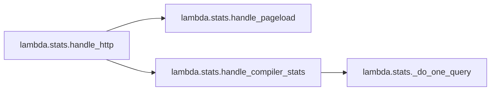

### Object Calls

* lambda.stats.handle_pageload
* lambda.stats.handle_compiler_stats

<!---Documatic-block-lambda.stats.handle_http-start--->
<details>
	<summary><code>lambda.stats.handle_http</code> code snippet</summary>

```python
def handle_http(event: Dict, metrics: MetricsLogger, sqs_client: Optional[botocore.client.BaseClient]=None, dynamo_client: Optional[botocore.client.BaseClient]=None, now: Optional[datetime.datetime]=None):
    sqs_client = sqs_client or boto3.client('sqs')
    dynamo_client = dynamo_client or boto3.client('dynamodb')
    now = now or datetime.datetime.utcnow()
    path = event['path'].split('/')[1:]
    method = event['httpMethod']
    if path == ['pageload'] and method == 'POST':
        return handle_pageload(event, metrics, now, os.environ['SQS_STATS_QUEUE'], sqs_client)
    if len(path) == 2 and path[0] == 'compiler-build' and (method == 'GET'):
        return handle_compiler_stats(path[1], os.environ['COMPILER_BUILD_TABLE'], dynamo_client)
    return dict(statusCode=404, statusDescription='404 Not Found', isBase64Encoded=False, headers=STATIC_HEADERS, body='Not found')
```
</details>
<!---Documatic-block-lambda.stats.handle_http-end--->
<!---Documatic-section-handle_http-end--->

# #
<!---Documatic-section-lambda.stats.handle_http-end--->

<!---Documatic-section-lambda.stats_test.test_should_handle_pageloads_with_many_sponsors-start--->
## lambda.stats_test.test_should_handle_pageloads_with_many_sponsors

<!---Documatic-section-test_should_handle_pageloads_with_many_sponsors-start--->
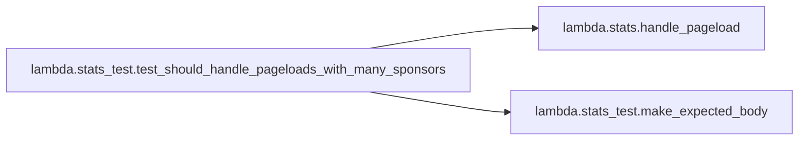

### Object Calls

* lambda.stats.handle_pageload
* lambda.stats_test.make_expected_body

<!---Documatic-block-lambda.stats_test.test_should_handle_pageloads_with_many_sponsors-start--->
<details>
	<summary><code>lambda.stats_test.test_should_handle_pageloads_with_many_sponsors</code> code snippet</summary>

```python
def test_should_handle_pageloads_with_many_sponsors(sqs_client):
    metrics = mock.Mock(spec_set=MetricsLogger)
    queue_url = 'some-queue-url'
    with Stubber(sqs_client) as stubber:
        stubber.add_response('send_message', {}, dict(QueueUrl=queue_url, MessageBody=ANY))
        for expectation in ('bob', 'alice', 'crystal'):
            stubber.add_response('send_message', {}, dict(QueueUrl=queue_url, MessageBody=make_expected_body('SponsorView', expectation)))
        handle_pageload(dict(queryStringParameters=dict(icons='bob,alice,crystal')), metrics, SOME_DATE, queue_url, sqs_client)
    metrics.set_property.assert_called_once_with('sponsors', ['bob', 'alice', 'crystal'])
```
</details>
<!---Documatic-block-lambda.stats_test.test_should_handle_pageloads_with_many_sponsors-end--->
<!---Documatic-section-test_should_handle_pageloads_with_many_sponsors-end--->

# #
<!---Documatic-section-lambda.stats_test.test_should_handle_pageloads_with_many_sponsors-end--->

<!---Documatic-section-lambda.cloudwatch_to_discord.lambda_handler-start--->
## lambda.cloudwatch_to_discord.lambda_handler

<!---Documatic-section-lambda_handler-start--->
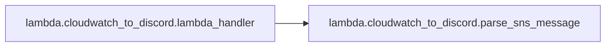

### Object Calls

* lambda.cloudwatch_to_discord.parse_sns_message

<!---Documatic-block-lambda.cloudwatch_to_discord.lambda_handler-start--->
<details>
	<summary><code>lambda.cloudwatch_to_discord.lambda_handler</code> code snippet</summary>

```python
def lambda_handler(event, _context):
    webhook_url = os.getenv('WEBHOOK_URL')
    for record in event.get('Records', []):
        discord_data = parse_sns_message(json.loads(record['Sns']['Message']))
        headers = {'content-type': 'application/json'}
        logging.info(discord_data)
        response = requests.post(webhook_url, data=json.dumps(discord_data), headers=headers)
        logging.info('Discord response: %s', response.status_code)
        logging.info(response.content)
```
</details>
<!---Documatic-block-lambda.cloudwatch_to_discord.lambda_handler-end--->
<!---Documatic-section-lambda_handler-end--->

# #
<!---Documatic-section-lambda.cloudwatch_to_discord.lambda_handler-end--->

<!---Documatic-section-lambda.stats.handle_compiler_stats-start--->
## lambda.stats.handle_compiler_stats

<!---Documatic-section-handle_compiler_stats-start--->
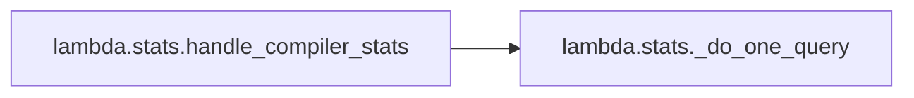

### Object Calls

* lambda.stats._do_one_query

<!---Documatic-block-lambda.stats.handle_compiler_stats-start--->
<details>
	<summary><code>lambda.stats.handle_compiler_stats</code> code snippet</summary>

```python
def handle_compiler_stats(compiler: str, table: str, dynamo_client: botocore.client.BaseClient) -> Dict:
    result = dict(last_success=_do_one_query(compiler, table, dynamo_client, 'OK'), last_build=_do_one_query(compiler, table, dynamo_client, None))
    return dict(statusCode=200, statusDescription='200 OK', isBase64Encoded=False, headers={'Content-Type': 'application/json; charset=utf-8', 'Cache-Control': 'max-age: 180, must-revalidate', 'Access-Control-Allow-Origin': '*'}, body=json.dumps(result))
```
</details>
<!---Documatic-block-lambda.stats.handle_compiler_stats-end--->
<!---Documatic-section-handle_compiler_stats-end--->

# #
<!---Documatic-section-lambda.stats.handle_compiler_stats-end--->

<!---Documatic-section-lambda.cloudwatch_to_discord_test.test_can_parse_traffic_event-start--->
## lambda.cloudwatch_to_discord_test.test_can_parse_traffic_event

<!---Documatic-section-test_can_parse_traffic_event-start--->
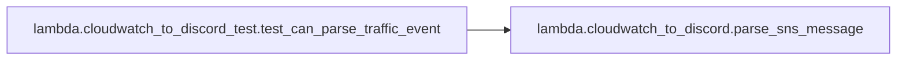

### Object Calls

* lambda.cloudwatch_to_discord.parse_sns_message

<!---Documatic-block-lambda.cloudwatch_to_discord_test.test_can_parse_traffic_event-start--->
<details>
	<summary><code>lambda.cloudwatch_to_discord_test.test_can_parse_traffic_event</code> code snippet</summary>

```python
def test_can_parse_traffic_event():
    result = parse_sns_message(EXAMPLE_TRAFFIC_EVENT)
    assert result['embeds'][0]['title'] == 'CloudWatch Alert - Traffic!'
```
</details>
<!---Documatic-block-lambda.cloudwatch_to_discord_test.test_can_parse_traffic_event-end--->
<!---Documatic-section-test_can_parse_traffic_event-end--->

# #
<!---Documatic-section-lambda.cloudwatch_to_discord_test.test_can_parse_traffic_event-end--->

<!---Documatic-section-lambda.stats_test.sqs_client-start--->
## lambda.stats_test.sqs_client

<!---Documatic-section-sqs_client-start--->
<!---Documatic-block-lambda.stats_test.sqs_client-start--->
<details>
	<summary><code>lambda.stats_test.sqs_client</code> code snippet</summary>

```python
@pytest.fixture
def sqs_client():
    return botocore.session.get_session().create_client('sqs', region_name='not-real')
```
</details>
<!---Documatic-block-lambda.stats_test.sqs_client-end--->
<!---Documatic-section-sqs_client-end--->

# #
<!---Documatic-section-lambda.stats_test.sqs_client-end--->

<!---Documatic-section-lambda.stats_test.test_should_handle_when_no_valid_compiler_builds-start--->
## lambda.stats_test.test_should_handle_when_no_valid_compiler_builds

<!---Documatic-section-test_should_handle_when_no_valid_compiler_builds-start--->
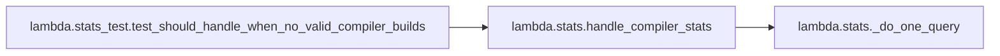

### Object Calls

* lambda.stats.handle_compiler_stats

<!---Documatic-block-lambda.stats_test.test_should_handle_when_no_valid_compiler_builds-start--->
<details>
	<summary><code>lambda.stats_test.test_should_handle_when_no_valid_compiler_builds</code> code snippet</summary>

```python
def test_should_handle_when_no_valid_compiler_builds(dynamodb_client):
    with Stubber(dynamodb_client) as stubber:
        stubber.add_response('query', dict(Count=0, Items=[]))
        stubber.add_response('query', dict(Count=0, Items=[]))
        result = handle_compiler_stats('some-compiler', 'compiler-table', dynamodb_client)
    assert result['statusCode'] == 200
    assert json.loads(result['body']) == dict(last_success=None, last_build=None)
```
</details>
<!---Documatic-block-lambda.stats_test.test_should_handle_when_no_valid_compiler_builds-end--->
<!---Documatic-section-test_should_handle_when_no_valid_compiler_builds-end--->

# #
<!---Documatic-section-lambda.stats_test.test_should_handle_when_no_valid_compiler_builds-end--->

<!---Documatic-section-lambda.stats._do_one_query-start--->
## lambda.stats._do_one_query

<!---Documatic-section-_do_one_query-start--->
<!---Documatic-block-lambda.stats._do_one_query-start--->
<details>
	<summary><code>lambda.stats._do_one_query</code> code snippet</summary>

```python
def _do_one_query(compiler: str, table: str, dynamo_client: botocore.client.BaseClient, status: Optional[str]) -> Optional[Dict]:
    params: Dict[str, Any] = dict(TableName=table, Limit=100, ScanIndexForward=False, KeyConditionExpression='#key = :compiler', ExpressionAttributeNames={'#key': 'compiler'}, ExpressionAttributeValues={':compiler': dict(S=compiler)})
    if status is not None:
        params['FilterExpression'] = '#status = :status_filter'
        params['ExpressionAttributeNames']['#status'] = 'status'
        params['ExpressionAttributeValues'][':status_filter'] = dict(S=status or 'na')
    query_results = dynamo_client.query(**params)
    if query_results['Count']:
        most_recent = query_results['Items'][0]
        return dict(path=most_recent['path']['S'], github_run_id=most_recent['github_run_id']['S'], timestamp=most_recent['timestamp']['S'], duration=int(most_recent['duration']['N']))
    return None
```
</details>
<!---Documatic-block-lambda.stats._do_one_query-end--->
<!---Documatic-section-_do_one_query-end--->

# #
<!---Documatic-section-lambda.stats._do_one_query-end--->

<!---Documatic-section-lambda.stats_test.test_should_query_compilers_with_the_right_query-start--->
## lambda.stats_test.test_should_query_compilers_with_the_right_query

<!---Documatic-section-test_should_query_compilers_with_the_right_query-start--->
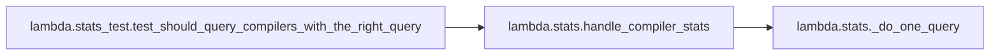

### Object Calls

* lambda.stats.handle_compiler_stats

<!---Documatic-block-lambda.stats_test.test_should_query_compilers_with_the_right_query-start--->
<details>
	<summary><code>lambda.stats_test.test_should_query_compilers_with_the_right_query</code> code snippet</summary>

```python
def test_should_query_compilers_with_the_right_query(dynamodb_client):
    with Stubber(dynamodb_client) as stubber:
        stubber.add_response('query', dict(Count=0, Items=[]), dict(TableName='compiler-table', Limit=100, ScanIndexForward=False, KeyConditionExpression='#key = :compiler', FilterExpression='#status = :status_filter', ExpressionAttributeNames={'#key': 'compiler', '#status': 'status'}, ExpressionAttributeValues={':status_filter': dict(S='OK'), ':compiler': dict(S='some-compiler')}))
        stubber.add_response('query', dict(Count=0, Items=[]), dict(TableName='compiler-table', Limit=100, ScanIndexForward=False, KeyConditionExpression='#key = :compiler', ExpressionAttributeNames={'#key': 'compiler'}, ExpressionAttributeValues={':compiler': dict(S='some-compiler')}))
        handle_compiler_stats('some-compiler', 'compiler-table', dynamodb_client)
```
</details>
<!---Documatic-block-lambda.stats_test.test_should_query_compilers_with_the_right_query-end--->
<!---Documatic-section-test_should_query_compilers_with_the_right_query-end--->

# #
<!---Documatic-section-lambda.stats_test.test_should_query_compilers_with_the_right_query-end--->

<!---Documatic-section-lambda.stats_test.s3_client-start--->
## lambda.stats_test.s3_client

<!---Documatic-section-s3_client-start--->
<!---Documatic-block-lambda.stats_test.s3_client-start--->
<details>
	<summary><code>lambda.stats_test.s3_client</code> code snippet</summary>

```python
@pytest.fixture
def s3_client():
    return botocore.session.get_session().create_client('s3', region_name='not-real')
```
</details>
<!---Documatic-block-lambda.stats_test.s3_client-end--->
<!---Documatic-section-s3_client-end--->

# #
<!---Documatic-section-lambda.stats_test.s3_client-end--->

<!---Documatic-section-lambda.stats.lambda_handler-start--->
## lambda.stats.lambda_handler

<!---Documatic-section-lambda_handler-start--->
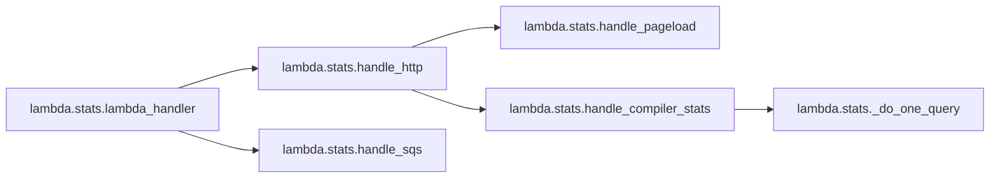

### Object Calls

* lambda.stats.handle_http
* lambda.stats.handle_sqs

<!---Documatic-block-lambda.stats.lambda_handler-start--->
<details>
	<summary><code>lambda.stats.lambda_handler</code> code snippet</summary>

```python
@aws_embedded_metrics.metric_scope
def lambda_handler(event, context, metrics):
    metrics.set_namespace('CompilerExplorer')
    logger.info('Received new lambda event %s', event)
    if RECORD_KEY in event:
        return handle_sqs(event, context)
    return handle_http(event, metrics)
```
</details>
<!---Documatic-block-lambda.stats.lambda_handler-end--->
<!---Documatic-section-lambda_handler-end--->

# #
<!---Documatic-section-lambda.stats.lambda_handler-end--->

<!---Documatic-section-lambda.stats_test.dynamodb_client-start--->
## lambda.stats_test.dynamodb_client

<!---Documatic-section-dynamodb_client-start--->
<!---Documatic-block-lambda.stats_test.dynamodb_client-start--->
<details>
	<summary><code>lambda.stats_test.dynamodb_client</code> code snippet</summary>

```python
@pytest.fixture
def dynamodb_client():
    return botocore.session.get_session().create_client('dynamodb', region_name='not-real')
```
</details>
<!---Documatic-block-lambda.stats_test.dynamodb_client-end--->
<!---Documatic-section-dynamodb_client-end--->

# #
<!---Documatic-section-lambda.stats_test.dynamodb_client-end--->

<!---Documatic-section-lambda.stats_test.test_should_handle_pageloads_with_no_sponsors-start--->
## lambda.stats_test.test_should_handle_pageloads_with_no_sponsors

<!---Documatic-section-test_should_handle_pageloads_with_no_sponsors-start--->
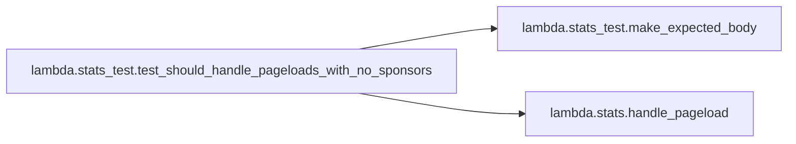

### Object Calls

* lambda.stats_test.make_expected_body
* lambda.stats.handle_pageload

<!---Documatic-block-lambda.stats_test.test_should_handle_pageloads_with_no_sponsors-start--->
<details>
	<summary><code>lambda.stats_test.test_should_handle_pageloads_with_no_sponsors</code> code snippet</summary>

```python
def test_should_handle_pageloads_with_no_sponsors(sqs_client):
    metrics = mock.Mock(spec_set=MetricsLogger)
    queue_url = 'some-queue-url'
    with Stubber(sqs_client) as stubber:
        stubber.add_response('send_message', {}, dict(QueueUrl=queue_url, MessageBody=make_expected_body('PageLoad', '')))
        handle_pageload(dict(queryStringParameters={}), metrics, SOME_DATE, queue_url, sqs_client)
    metrics.set_property.assert_called_once_with('sponsors', [])
    metrics.put_metric.assert_called_once_with('PageLoad', 1)
```
</details>
<!---Documatic-block-lambda.stats_test.test_should_handle_pageloads_with_no_sponsors-end--->
<!---Documatic-section-test_should_handle_pageloads_with_no_sponsors-end--->

# #
<!---Documatic-section-lambda.stats_test.test_should_handle_pageloads_with_no_sponsors-end--->

<!---Documatic-section-lambda.stats_test.test_should_store_results_from_sqs_correctly-start--->
## lambda.stats_test.test_should_store_results_from_sqs_correctly

<!---Documatic-section-test_should_store_results_from_sqs_correctly-start--->
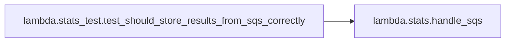

### Object Calls

* lambda.stats.handle_sqs

<!---Documatic-block-lambda.stats_test.test_should_store_results_from_sqs_correctly-start--->
<details>
	<summary><code>lambda.stats_test.test_should_store_results_from_sqs_correctly</code> code snippet</summary>

```python
@mock.patch.dict(os.environ, dict(S3_BUCKET_NAME='not-a-real-bucket'))
def test_should_store_results_from_sqs_correctly(s3_client):
    context = mock.Mock(function_name='some_func')
    event = dict(Records=[dict(body='first'), dict(body='second')])
    with Stubber(s3_client) as stubber:
        stubber.add_response('put_object', {}, dict(Body='first\nsecond', Bucket='not-a-real-bucket', Key='stats/some_func-2020-01-02-03:04:05.012312.log'))
        handle_sqs(event, context, s3_client, SOME_DATE)
```
</details>
<!---Documatic-block-lambda.stats_test.test_should_store_results_from_sqs_correctly-end--->
<!---Documatic-section-test_should_store_results_from_sqs_correctly-end--->

# #
<!---Documatic-section-lambda.stats_test.test_should_store_results_from_sqs_correctly-end--->

<!---Documatic-section-lambda.stats.handle_pageload-start--->
## lambda.stats.handle_pageload

<!---Documatic-section-handle_pageload-start--->
<!---Documatic-block-lambda.stats.handle_pageload-start--->
<details>
	<summary><code>lambda.stats.handle_pageload</code> code snippet</summary>

```python
def handle_pageload(event: Dict, metrics: MetricsLogger, now: datetime.datetime, queue_url: str, sqs_client: botocore.client.BaseClient):
    date = now.strftime('%Y-%m-%d')
    time = now.strftime('%H:%M:%S')
    sqs_client.send_message(QueueUrl=queue_url, MessageBody=json.dumps(dict(type='PageLoad', date=date, time=time, value=''), sort_keys=True))
    icons = urllib.parse.unquote_plus(event['queryStringParameters'].get('icons', ''))
    sponsors = list(filter(lambda x: x, icons.split(',')))
    for sponsor in sponsors:
        sqs_client.send_message(QueueUrl=queue_url, MessageBody=json.dumps(dict(type='SponsorView', date=date, time=time, value=sponsor), sort_keys=True))
    metrics.set_property('sponsors', sponsors)
    metrics.put_metric('PageLoad', 1)
    return dict(statusCode=200, statusDescription='200 OK', isBase64Encoded=False, headers=STATIC_HEADERS, body='Ok')
```
</details>
<!---Documatic-block-lambda.stats.handle_pageload-end--->
<!---Documatic-section-handle_pageload-end--->

# #
<!---Documatic-section-lambda.stats.handle_pageload-end--->

<!---Documatic-section-lambda.stats_test.test_should_handle_pageloads_with_many_sponsors_uri_encoded-start--->
## lambda.stats_test.test_should_handle_pageloads_with_many_sponsors_uri_encoded

<!---Documatic-section-test_should_handle_pageloads_with_many_sponsors_uri_encoded-start--->
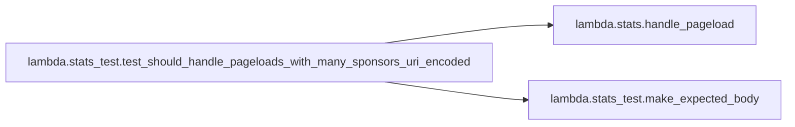

### Object Calls

* lambda.stats.handle_pageload
* lambda.stats_test.make_expected_body

<!---Documatic-block-lambda.stats_test.test_should_handle_pageloads_with_many_sponsors_uri_encoded-start--->
<details>
	<summary><code>lambda.stats_test.test_should_handle_pageloads_with_many_sponsors_uri_encoded</code> code snippet</summary>

```python
def test_should_handle_pageloads_with_many_sponsors_uri_encoded(sqs_client):
    metrics = mock.Mock(spec_set=MetricsLogger)
    queue_url = 'some-queue-url'
    with Stubber(sqs_client) as stubber:
        stubber.add_response('send_message', {}, dict(QueueUrl=queue_url, MessageBody=ANY))
        for expectation in ('bob', 'alice', 'crystal'):
            stubber.add_response('send_message', {}, dict(QueueUrl=queue_url, MessageBody=make_expected_body('SponsorView', expectation)))
        handle_pageload(dict(queryStringParameters=dict(icons='bob%2Calice%2Ccrystal')), metrics, SOME_DATE, queue_url, sqs_client)
    metrics.set_property.assert_called_once_with('sponsors', ['bob', 'alice', 'crystal'])
```
</details>
<!---Documatic-block-lambda.stats_test.test_should_handle_pageloads_with_many_sponsors_uri_encoded-end--->
<!---Documatic-section-test_should_handle_pageloads_with_many_sponsors_uri_encoded-end--->

# #
<!---Documatic-section-lambda.stats_test.test_should_handle_pageloads_with_many_sponsors_uri_encoded-end--->

<!---Documatic-section-lambda.stats_test.make_expected_body-start--->
## lambda.stats_test.make_expected_body

<!---Documatic-section-make_expected_body-start--->
<!---Documatic-block-lambda.stats_test.make_expected_body-start--->
<details>
	<summary><code>lambda.stats_test.make_expected_body</code> code snippet</summary>

```python
def make_expected_body(msg_type: str, value: str):
    return f'{{"date": "2020-01-02", "time": "03:04:05", "type": "{msg_type}", "value": "{value}"}}'
```
</details>
<!---Documatic-block-lambda.stats_test.make_expected_body-end--->
<!---Documatic-section-make_expected_body-end--->

# #
<!---Documatic-section-lambda.stats_test.make_expected_body-end--->

<!---Documatic-section-lambda.stats_test.test_pageloads_should_return_a_200_doc-start--->
## lambda.stats_test.test_pageloads_should_return_a_200_doc

<!---Documatic-section-test_pageloads_should_return_a_200_doc-start--->
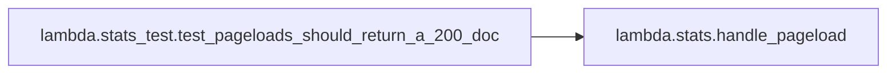

### Object Calls

* lambda.stats.handle_pageload

<!---Documatic-block-lambda.stats_test.test_pageloads_should_return_a_200_doc-start--->
<details>
	<summary><code>lambda.stats_test.test_pageloads_should_return_a_200_doc</code> code snippet</summary>

```python
def test_pageloads_should_return_a_200_doc():
    metrics = mock.Mock(spec_set=MetricsLogger)
    queue_url = 'some-queue-url'
    result = handle_pageload(dict(queryStringParameters={}), metrics, SOME_DATE, queue_url, mock.Mock())
    assert result['statusCode'] == 200
    assert result['body'] == 'Ok'
    metrics.put_metric.assert_called_once_with('PageLoad', 1)
```
</details>
<!---Documatic-block-lambda.stats_test.test_pageloads_should_return_a_200_doc-end--->
<!---Documatic-section-test_pageloads_should_return_a_200_doc-end--->

# #
<!---Documatic-section-lambda.stats_test.test_pageloads_should_return_a_200_doc-end--->

[_Documentation generated by Documatic_](https://www.documatic.com)